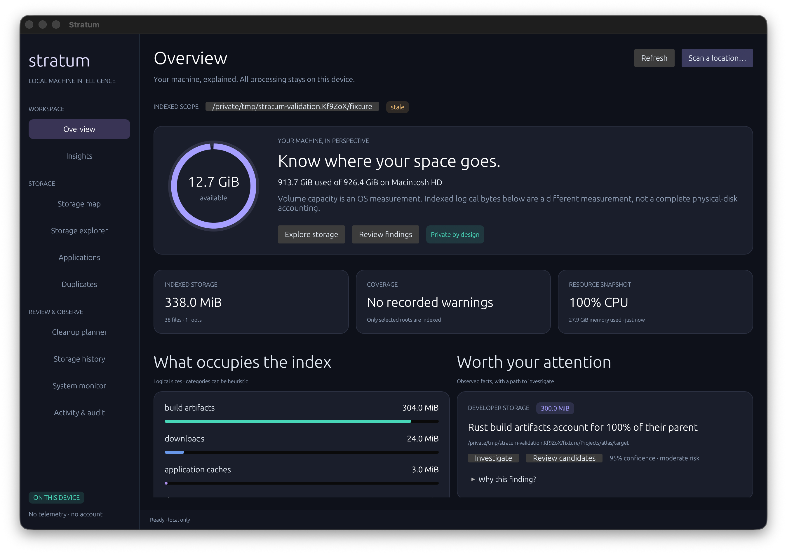

# Stratum

A local machine intelligence platform written in Rust. Stratum combines a persistent filesystem index, storage analysis, explainable rules, application footprints, system snapshots, and a conservative quarantine workflow. It does not require an AI model, account, cloud service, or permanent daemon.

This is a new **0.1 developer release**, with macOS as the primary target. See [progress and limitations](docs/progress.md) for the distinction between working capabilities and the longer-term product vision.



Screenshots use generated filesystem fixtures; capacity and resource cards show live host OS observations. See [onboarding](docs/screenshots/onboarding.png), [storage map](docs/screenshots/storage-map.png), [cleanup review](docs/screenshots/cleanup.png), the [scan dialog](docs/screenshots/scan-dialog.png) in the light appearance, the [system monitor](docs/screenshots/system.png) and the [terminal interface](docs/screenshots/terminal.png).

The desktop is a native application with a module sidebar, bundled Inter and JetBrains Mono typography, Phosphor icons, and dark or light appearances that follow the system. Capacity rings, category bars, the treemap and the history chart animate into place; findings link to their evidence; the scan dialog offers quick-pick locations; and a floating activity card exposes pause, resume and cancel during long work. The terminal interface (`stratum-tui`) covers the same nine pages with keyboard navigation, live scan progress, duplicate verification and the full plan-and-approve cleanup flow. Nothing is preselected on either surface, quarantine stays reversible, and no scan starts without an explicit request. See the [product research and UX direction](docs/product-research.md) for the rationale and commercial-readiness gates.

## Run

Requires Rust 1.94 or newer, a C compiler, and macOS or Linux. Linux desktop builds also need the native packages listed in [development](docs/development.md).

```sh
cargo build --release --workspace
./target/release/stratum scan "$HOME/Projects"
./target/release/stratum storage largest-files
./target/release/stratum storage largest-dirs
./target/release/stratum storage categories --json
./target/release/stratum duplicates scan --json
./target/release/stratum insights --json
./target/release/stratum-desktop
./target/release/stratum-tui
```

The first scan of a location fills every page while it runs; opening a saved index never rescans, and rescanning keeps the saved index in view until the new one is published. `stratum-desktop --appearance dark|light` overrides the system appearance and `--page map` opens a specific page; `stratum-tui --palette ansi` limits the terminal interface to sixteen colours. Scan your home with `stratum scan "$HOME"`, or a volume with `stratum scan /Volumes/Example`. `scan --full` requests `/` with mount boundaries preserved by default. Permission failures produce a partial scan and recorded warnings. macOS privacy controls may require Full Disk Access for the terminal/application. No privilege elevation is attempted.

Use non-overlapping roots. Once a root is indexed, rescan it instead of separately indexing a child. Each run persists its index in a dedicated private data directory, by default `~/.local/share/stratum`. Queries work after restarting without another scan. Use `--data-dir /absolute/dedicated/path`, `STRATUM_DATA_DIR`, or `--config config.toml` to select another instance.

## Inspection and action are separate

```sh
stratum files --min-size 1GiB --extension dmg --json
stratum storage history --path /absolute/indexed/directory --json
stratum storage breakdown /absolute/indexed/directory --json
stratum apps inspect Example --json
stratum apps uninstall-plan Example --json
stratum system --json
stratum process top --limit 20 --json
stratum explain-storage --json

stratum cleanup locations --json
stratum cleanup candidates --path "$HOME/Projects/app/target" --limit 100 --json
stratum cleanup plan --path /absolute/project/target/debug/example --json
stratum cleanup show PLAN_ID --json
stratum cleanup execute PLAN_ID --approve 'QUARANTINE PLAN_ID' --json
stratum cleanup undo OPERATION_ID --json
```

Cleanup supports explicit, indexed, regular Cargo artifact and recognized package-cache files. It rejects changed files, hard links, symlinks, protected locations, directories, cross-device moves and expired plans. There is no arbitrary delete endpoint. Application uninstall proposals and duplicate groups are review-only in 0.1.

**Quarantine preserves bytes on the same filesystem; it does not free disk capacity.** No automatic permanent deletion or expiry purge is implemented. Quarantined files can be restored if their original location is available and their integrity remains valid. Stop active builds before acting on build artifacts.

## Local API and daemon

```sh
stratum api serve
# In another terminal, explicitly retrieve the local credential:
stratum api token --json
# Watch indexed roots, reconcile changes, sample the system, and serve the API:
stratum daemon start
# Export OpenAPI without opening the database:
stratum api openapi --json
```

The API binds to `127.0.0.1:7391`. Every route requires a bearer token, including health, events and OpenAPI. Browser-origin requests and non-loopback binds are rejected. The token is generated in the private state directory with mode `0600`. Long operations return queryable job IDs; events stream through authenticated SSE.

```sh
curl -H "Authorization: Bearer $STRATUM_TOKEN" \
  'http://127.0.0.1:7391/api/v1/files?kind=file&limit=20'
```

No filenames, file contents, process data, inventory, or usage telemetry are uploaded. The database and local API contain sensitive machine information: protect the state directory and token. See [privacy and security](docs/security.md).

## Architecture and reference

- [Architecture](docs/architecture.md): crate boundaries and shared application services
- [API](docs/api.md): v1 resources, error codes, pagination and job semantics
- [Storage model](docs/storage-model.md): generations, aggregates and freshness
- [Cleanup safety](docs/cleanup-safety.md): exact guarantees and remaining race limits
- [Platform support](docs/platform-support.md): supported and unavailable capabilities
- [MCP integration](docs/mcp-integration.md): build a thin adapter without filesystem access
- [Development](docs/development.md): tests, fixture generation, benchmarks and release packaging
- [Progress](docs/progress.md): validation results, limitations and next work
- [Product research](docs/product-research.md): competitive patterns, product hypothesis and desktop direction

Licensed under MIT OR Apache-2.0.
